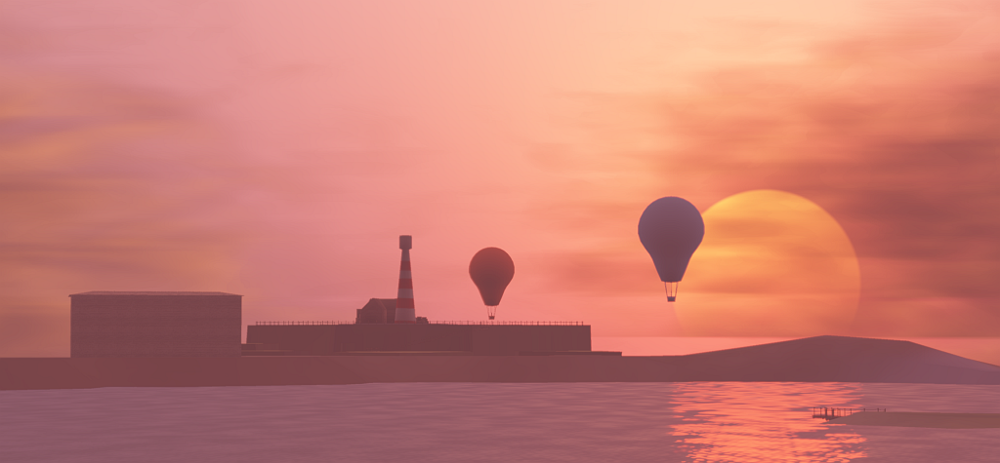

# Shatter Engine™
This is a small game engine framework that is used to power some of my personal projects.

# Installation
Make sure you create an EngineMacros.props file for your game projects with a User Macro named EnginePath that points at the location of the engine solution file.

# Third Party
The engine requires a couple of third party libraries which aren't available in this repository.

* ThirdParty/glad/ - GLAD for OpenGL 3.3 with the KHR debug extension
* ThirdParty/glfw-3.2.1.bin.WIN64/ - GLFW 3.2.1
* ThirdParty/glm/ - GLM 0.9.8.5
* ThirdParty/imgui-1.70/ - dear imgui 1.70
* ThirdParty/SFML-2.5.1/ - SFML 2.5.1 (for audio)
* ThirdParty/stb/ - STB
* ThirdParty/discord-rpc/ - Discord Rich Presence